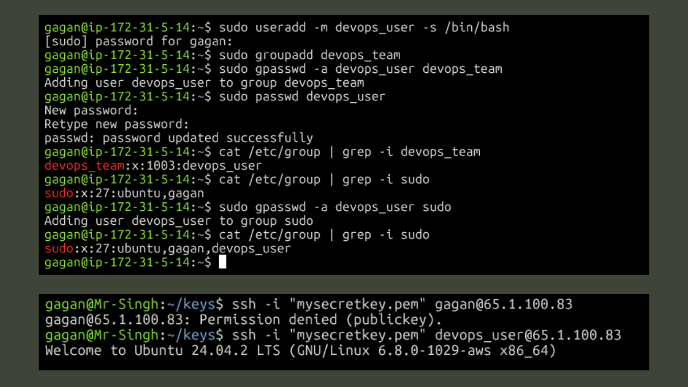
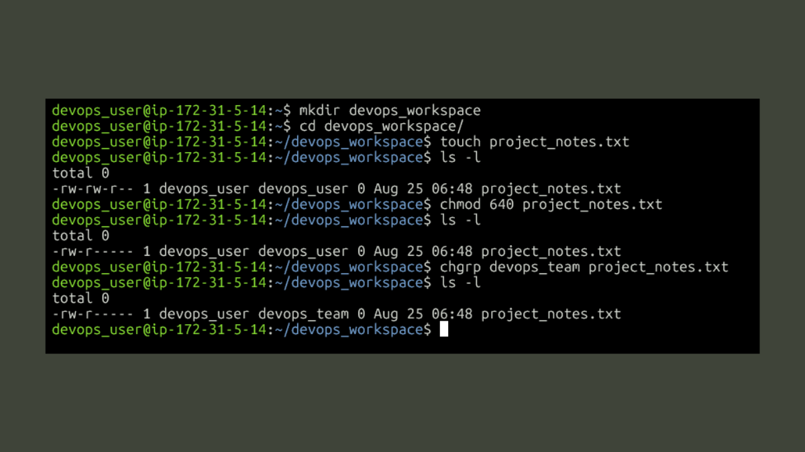

# Week 2: Linux System Administration & Automation

This directory contains all my work for Week 2 of the #90DaysOfDevOps challenge. The project's goal was to simulate managing a **Linux-based production server**, focusing on real-world tasks like user management, log analysis, volume management, and automation. All tasks were executed and verified on an Ubuntu server.

## Table of Contents
1.  [Task 1: User & Group Management](#task-1-user--group-management)
2.  [Task 2: File & Directory Permissions](#task-2-file--directory-permissions)
3.  [Task 3: Log File Analysis](#task-3-log-file-analysis)
4.  [Task 4: Volume Management (Standard & LVM)](#task-4-volume-management-standard--lvm)
5.  [Task 5: Process Management](#task-5-process-management)
6.  [Task 6: Automation with Shell Scripting](#task-6-automation-with-shell-scripting)
7.  [Bonus Tasks](#bonus-tasks)
8.  [Key Learnings](#key-learnings)

---

### Task 1: User & Group Management
**Objective:** Create user `devops_user`, add to group `devops_team`, grant sudo, and restrict SSH.

1.  **User & Group Creation:** The following commands were used to create the user with a home directory (`-m`) and `bash` shell (`-s`), create the group, set a password, and grant `sudo` access by adding the user to the `sudo` group.
    ```bash
    sudo useradd -m devops_user -s /bin/bash
    sudo groupadd devops_team
    sudo gpasswd -a devops_user devops_team
    sudo passwd devops_user
    sudo gpasswd -a devops_user sudo
    ```
2.  **Verification:** I verified the changes by inspecting `/etc/group`.
    ```bash
    cat /etc/group | grep -i devops_team
    # Output: devops_team:x:1003:devops_user

    cat /etc/group | grep -i sudo
    # Output: sudo:x:27:ubuntu,gagan,devops_user
    ```
3.  **SSH Configuration:** I edited `/etc/ssh/sshd_config` and added these lines to enforce a strict access policy:
    ```
    AllowUsers devops_user
    DenyUsers gagan
    AllowGroups devops_team
    ```
4.  **Applying Changes & Troubleshooting:** After restarting the SSH service, I encountered a `Permission denied (publickey)` error. I resolved this by copying the public key from the `ubuntu` user's `.ssh/authorized_keys` file into new `.ssh/authorized_keys` files for my other users. Final testing confirmed `devops_user` could log in, while `gagan` was correctly denied.



---
### Task 2: File & Directory Permissions
**Objective:** Create `/devops_workspace` and `project_notes.txt` with permissions for owner (edit), group (read), and others (none).

1.  **Creation:** The directory and file were created while logged in as `devops_user`.
    ```bash
    mkdir devops_workspace
    cd devops_workspace/
    touch project_notes.txt
    ```
2.  **Applying Permissions:** I used `chmod 640` to set the required permissions (`rw-r-----`) and `chgrp` to assign the correct group.
    ```bash
    chmod 640 project_notes.txt
    chgrp devops_team project_notes.txt
    ```
3.  **Verification:** I ran `ls -l` before and after to confirm the changes were applied correctly.



---
### Task 3: Log File Analysis
**Objective:** Analyze the `Linux_2k.log` file using `grep`, `awk`, and `sed`.

1.  **Download and Search:** I downloaded the log file with `wget` and performed an initial search for errors.
    ```bash
    grep -i error Linux_2k.log
    ```
2.  **Extract with `awk`:** I used `awk` to parse the log and print the 3rd, 6th, and 7th columns, extracting key information.
    ```bash
    awk '{print $3,$6,$7}' Linux_2k.log
    ```
3.  **Redact with `sed`:** For security, I redacted all IP addresses from the log output using `sed` and an extended regular expression.
    ```bash
    sed -E "s/[0-9]+\.[0-9]+\.[0-9]+\.[0-9]+/[REDACTED]/g" Linux_2k.log
    ```
**My Regex Notes:**
    *   `-E` is extended regular expressions here; instead of writing it like `\+` we can only put `+`.
    *   `[0-9]` digits from 0 to 9.
    *   `[0-9]+` the digits can also be more than single, like `12`, `123`, `1234`.
    *   `\.` is to literally put dot (`.`) there, because if we do not use escape `\` and only use `.`, it means "any single character", so it will also match with something like `123a453b67d` not `12.23.41.324`.


---
### Task 4: Volume Management (Standard & LVM)
**Objective:** Mount a new volume and explore Logical Volume Management (LVM).

1.  **Standard Mount:** I attached a 10 GiB EBS volume (`/dev/nvme1n1`), created a mount point, formatted the volume with `ext4`, and mounted it.
    ```bash
    sudo mkdir /mnt/devops_data
    sudo mkfs.ext4 /dev/nvme1n1
    sudo mount /dev/nvme1n1 /mnt/devops_data
    ```
    I verified the mount was successful using `df -h` and `mount | grep devops_data`.

2.  **LVM Exploration:** I attached two more volumes to explore a more flexible storage solution.
    *   **PV/VG/LV Creation:** I initialized the disks as Physical Volumes, created a Volume Group to pool them, and then created a 13 GiB Logical Volume.
        ```bash
        sudo pvcreate /dev/nvme2n1 /dev/nvme3n1
        sudo vgcreate my_test_vg /dev/nvme2n1 /dev/nvme3n1
        sudo lvcreate -L 13G -n my_test_lv my_test_vg
        ```
    *   **Extending:** To demonstrate LVM's flexibility, I extended the logical volume by 5 GiB.
        ```bash
        sudo lvextend -L +5G /dev/my_test_vg/my_test_lv
        ```
    All steps were verified with `pvs`, `vgs`, `lvs`, and a final `lsblk` to view the complete storage structure.


---
### Task 5: Process Management
**Objective:** Start, monitor, and kill a background process.

1.  **Start & Monitor:** I ran a `ping` command in the background using `&`, which returned the PID `1288`. I then used `ps` and `htop` to monitor the running process.
    ```bash
    ping google.com > ping_test.log &
    htop
    ```
2.  **Kill Process:** I used the `kill` command to terminate the process, and verified its termination with `ps`.
    ```bash
    kill 1288
    # Shell output: [1]+  Terminated   ping google.com > ping_test.log
    ps
    ```


---
### Task 6: Automation with Shell Scripting
**Objective:** Write a backup script and schedule it with `cron`.

1.  **Backup Script:** I created a reusable backup script that generates a timestamped backups of a specified directory. The full script can be found here: [scripts/backup_script.sh](scripts/backup_script.sh).

2.  **Execution & Scheduling:** I made the script executable (`chmod 764`), tested it manually, and then scheduled it to run every minute by adding the following line to the root user's crontab:
    ```crontab
    * * * * * bash /home/gagan/backup_script.sh /home/gagan/devops_workspace
    ```
    I used `watch ls` to confirm that the cron job was executing successfully and creating new backup files automatically.


---
### Bonus Tasks

1.  **Top 5 Log Messages:** I used a command pipeline to find the most frequent log entries by removing the variable data before counting.
    ```bash
    sort Linux_2k.log | awk '$5=""; {print}' | uniq -c | awk '{print}' | sort -nr | head -n 5
    ```

2.  **Find Files Modified in the Last 7 Days:** To find recently modified files, I used the find command with the `-mtime` condition. This searches the current directory and subdirectories for files modified within the last 7 days.
    ```bash
    find -mtime -7
    ```

3.  **Error/Warning Script:** I wrote a user-interactive script to filter a log file for "error" and "warning" messages and print the corresponding line numbers. The full script can be found here: [scripts/log_checker.sh](scripts/log_checker.sh).
    ```bash
    ./log_checker.sh
    # ENTER THE FILE PATH TO CHECK LOGS: /home/gagan/logs/Linux_2k.log
    ```


---
### Key Learnings

This week was great because it was all about practical, hands-on tasks. My favorite part was troubleshooting the SSH login error after setting up the new security rules. It felt like solving a real-world problem, not just following a guide. I also really enjoyed exploring LVM on my own. It was cool to learn how companies manage disk space in a more flexible way.