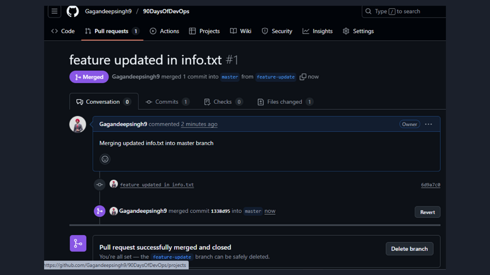
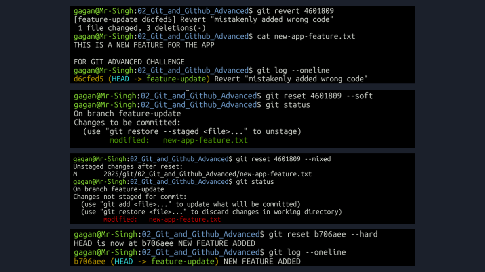
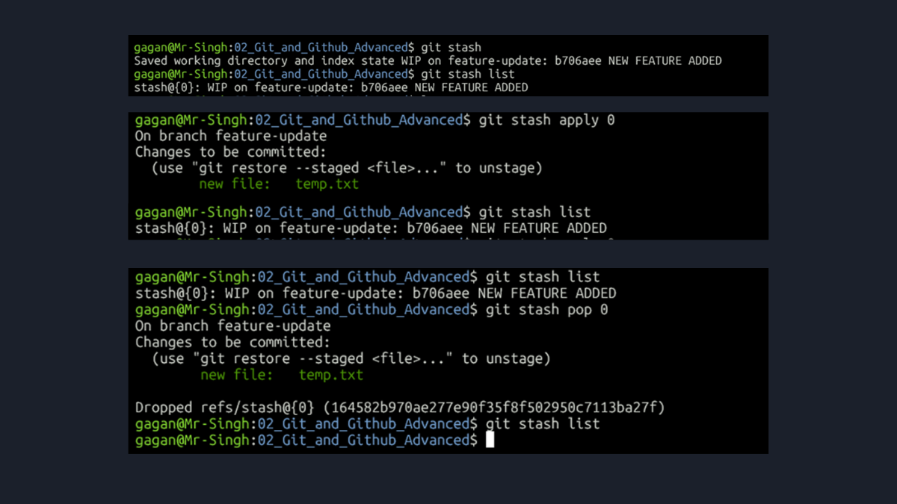
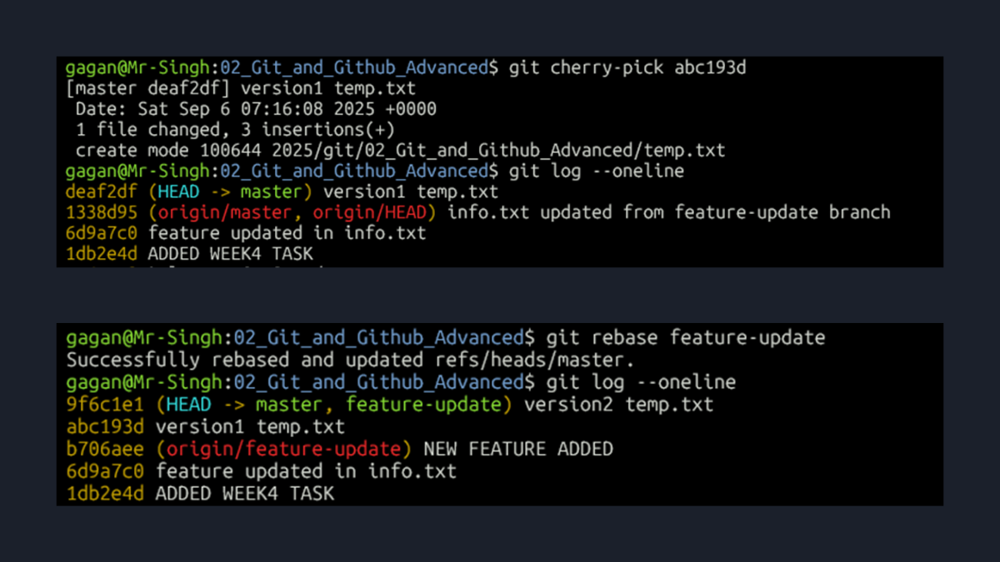

# Week 4: Advanced Git for Team Collaboration

This directory contains my project report for Week 4 of the #90DaysOfDevOps challenge. This week's focus was on the advanced Git commands and workflows that are essential for collaborating effectively on a team.

All the hands-on work for this challenge was performed in a fork of the official project repository. The process concluded with a successful Pull Request, which is the standard way of contributing to a shared codebase.

**➡️ You can view my final Pull Request here:** [feature updated in info.txt #1](https://github.com/Gagandeepsingh9/90DaysOfDevOps/pull/1) 
---

### Key Workflows I Practiced

#### 1. The Standard Contribution Workflow (Pull Requests)
I practiced the full, real-world cycle of contributing to a project: I forked the main repository, cloned my fork, created a dedicated `feature-update` branch for my changes, and submitted a Pull Request to have my work reviewed and merged. I finished by syncing my local `master` branch with the updated remote.

*   **Bonus - Upgrading to SSH Authentication:** As part of the challenge, I also focused on professional authentication methods. While HTTPS with a Personal Access Token (PAT) works, I set up the more secure and standard SSH method. This works with a key pair: the private key is kept securely on my local machine, while the public key is added to my GitHub account settings.

#### 2. Undoing Changes: `revert` vs. `reset`
I worked with the two main methods for undoing commits, learning when to use each one. My screenshots document my hands-on practice with each command.

*   **`git revert`:** I used this to safely undo a change on a shared branch. As shown in my work, it creates a new "Revert" commit that reverses a mistake, which is the best practice because it preserves the project's history for everyone on the team.

*   **`git reset`:** This is a powerful tool for cleaning up my *local* history before sharing it. I demonstrated the three main modes to show my full understanding:
    *   `--soft`: Undid the commit but kept the changes in the staging area (as my screenshot shows in the "Changes to be committed" section of `git status`).
    *   `--mixed`: Undid the commit and moved the changes back to the working directory, unstaged (as my screenshot shows in the "Changes not staged for commit" section).
    *   `--hard`: Completely and permanently discarded the commit and all associated changes from my working directory.

#### 3. Managing Work in Progress with `git stash`
I practiced using `git stash` to save uncommitted changes when I needed to switch branches quickly. My screenshots show my exploration of the entire flow, including the key difference between `apply` and `pop`.

*   `git stash`: Used to save my changes and clean the working directory.
*   `git stash list`: Used to view all saved stashes.
*   `git stash apply`: This command re-applies the changes but **keeps the stash in the list** for potential reuse.
*   `git stash pop`: This command re-applies the changes and **removes them from the stash list**, which is the most common use case.

#### 4. Keeping a Clean Commit History: `cherry-pick` & `rebase`
I learned two advanced techniques for maintaining a clean and understandable project history, and my screenshots show the `git log` before and after each operation.
*   **`git cherry-pick`:** I used this to select one specific commit from my feature branch and apply it directly to the master branch. This is a great way to release a small, critical fix without merging an entire feature.
*   **`git rebase`:** I used this to integrate the `feature-update` branch into `master`. Instead of a standard `git merge`, I checked out the `master` branch and ran `git rebase feature-update`. As my `git log` screenshot shows, this resulted in a perfectly linear history, with all the feature commits now appearing on `master` in the order they were created. This is a much cleaner outcome than a standard merge, which would have created an extra merge commit.

---
### My Key Takeaway
This week was crucial for understanding the difference between using Git for solo projects and using it as part of a professional team. I'm now much more comfortable with the workflows and commands needed to contribute to a shared codebase cleanly, safely, and efficiently.