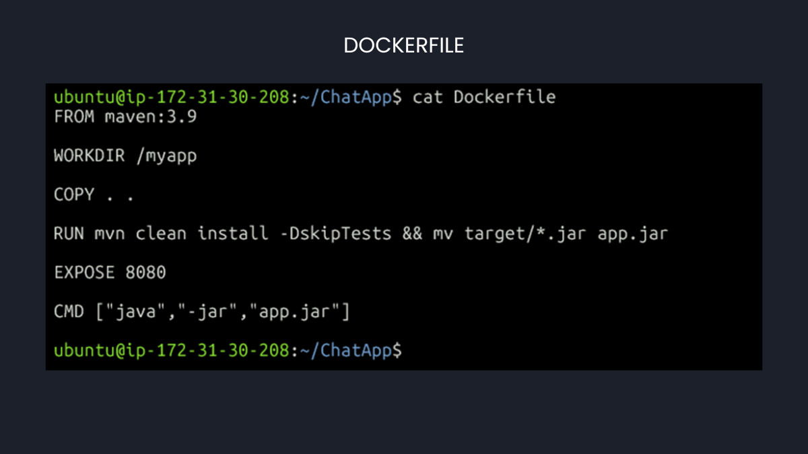
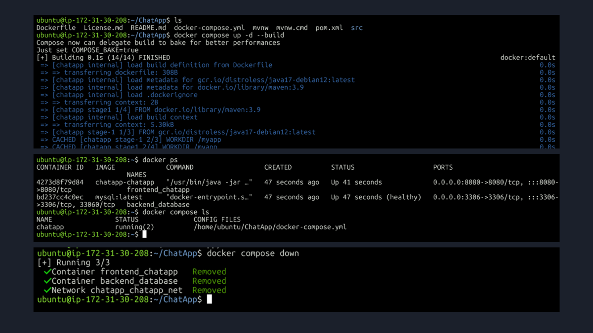
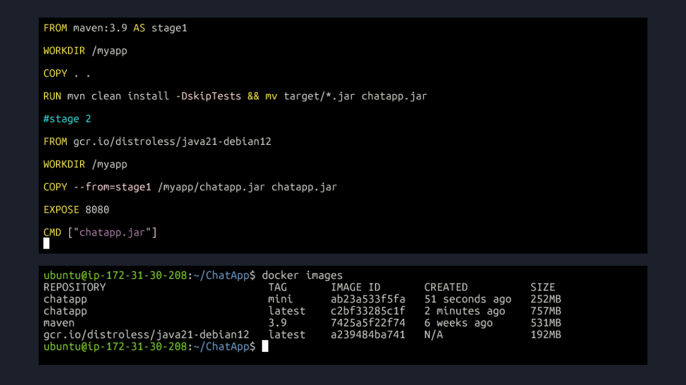
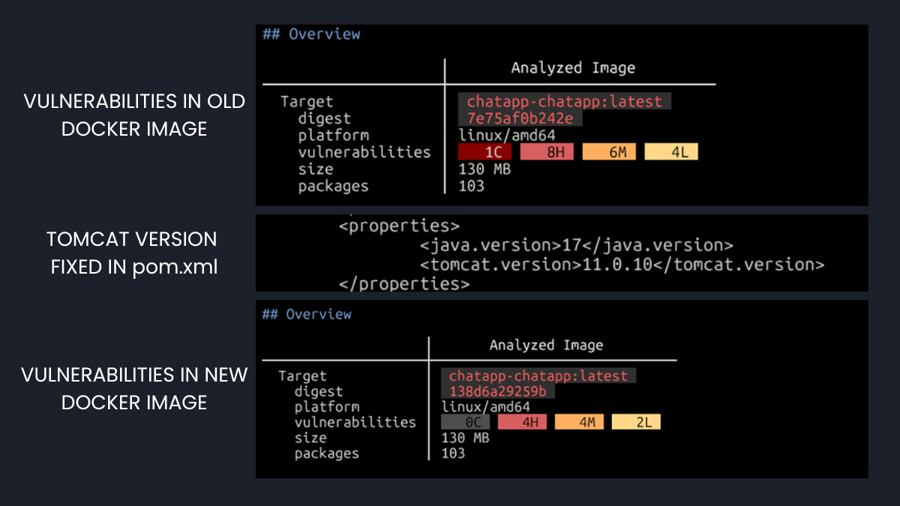

# Week 5: Building a Containerized Application with Docker

This directory contains my project report for Week 5 of the #90DaysOfDevOps challenge. This week was a deep dive into Docker. I took a real-world chat application, containerized it, and took it through a full lifecycle of optimization, orchestration, and security scanning.

All the hands-on work, including the `Dockerfile` and `docker-compose.yml`, was done on a dedicated branch in a fork of the original application repository.

**View All Code & Dockerfiles on GitHub:**
[**Gagandeepsingh9/ChatApp (branch: week5-docker)**](https://github.com/Gagandeepsingh9/ChatApp/tree/week5-docker)

---

### Key Skills I Practiced

#### 1. Containerizing a Java Application
My first step was to write a `Dockerfile` to package the Java chat app into an image. I used a Maven base image to build the app from its source code, which created a self-contained image ready for distribution and use.

#### 2. Running a Multi-Container App with Docker Compose
Real applications have multiple parts, so I used Docker Compose to manage the entire setup. My screenshots show me first creating a volume and network manually, and then codifying this setup into a `docker-compose.yml` file to define and connect all the services with a single command.

My final Compose setup included:
*   **The Chat App Service:** Built from my custom `Dockerfile`.
*   **A MySQL Database Service:** Using the official `mysql` image from Docker Hub.
*   **A Custom Network:** I defined a network within the Compose file and attached both services to it. This is the key step that allows the chat app to find and communicate with the database using its simple service name.
*   **A Persistent Volume:** To ensure the database's data was safe, I created a named volume and mounted it directly to `/var/lib/mysql` inside the database container. This is the standard path for MySQL data, and this step ensures that all chat messages are safely stored on the host machine and are not lost if the container is restarted or recreated.

**View my `docker-compose.yml` file here:** [**docker-compose.yml**](https://github.com/Gagandeepsingh9/ChatApp/blob/week5-docker/docker-compose.yml)

#### 3. Optimizing the Image for Production
The first image I built was **757MB**, which is too big for a real-world application. I fixed this by rewriting the `Dockerfile` to use a **multi-stage build**.
*   **Stage 1 ("The Builder"):** Used the big `maven` image to compile the app.
*   **Stage 2 ("The Runner"):** Used a tiny, secure `distroless` image and only copied the final `.jar` file from the builder.

This was a big success. The new image was only **252MB**, a **66% reduction** in size. This makes it faster and more secure.

**View my `Multi-Stage Dockerfile` here:** [**Dockerfile**](https://github.com/Gagandeepsingh9/ChatApp/blob/week5-docker/Dockerfile)

#### 4. Finding and Fixing Security Vulnerabilities
This was the most important part of the challenge. I used **Docker Scout** to scan my final image for security issues.

1.  **Scan:** The first scan found **19 vulnerabilities**, including one rated "Critical".
2.  **Identify:** I looked at the report and figured out the issues were related to the version of Tomcat the app was using.
3.  **Fix:** I edited the project's `pom.xml` file to use a newer, safer version of Tomcat.
4.  **Verify:** I rebuilt the image and scanned it again. The new scan showed only **10 vulnerabilities** and, most importantly, **zero Criticals**.

This **Scan -> Identify -> Fix -> Verify** process is a key part of DevSecOps, and it was great to put it into practice.

---
### My Key Takeaway
This week was a fantastic, hands-on experience. I learned how to manage the full lifecycle of a containerized application—from the first build to orchestrating it with persistent data and proper networking, making it smaller and faster, and, most importantly, making it more secure.