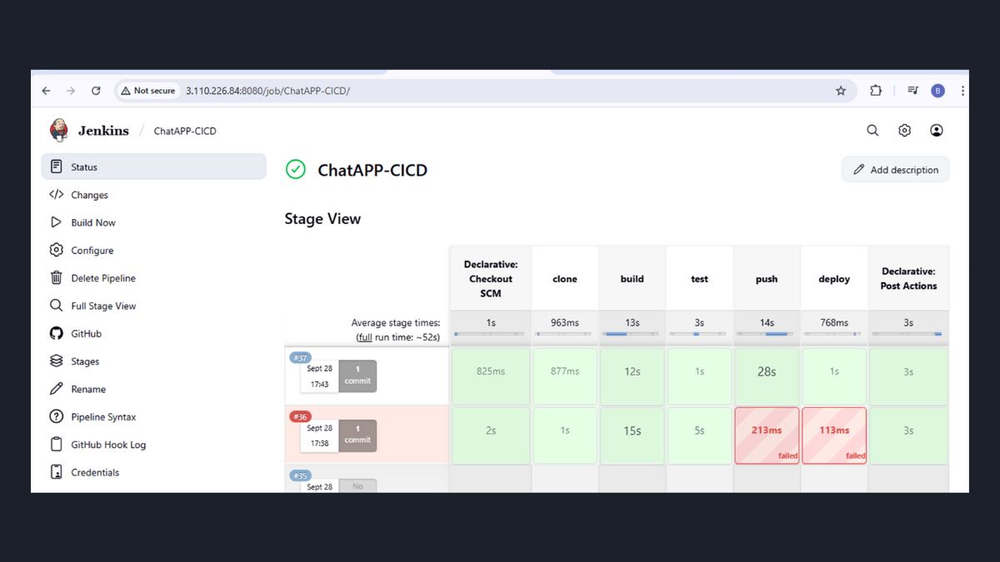
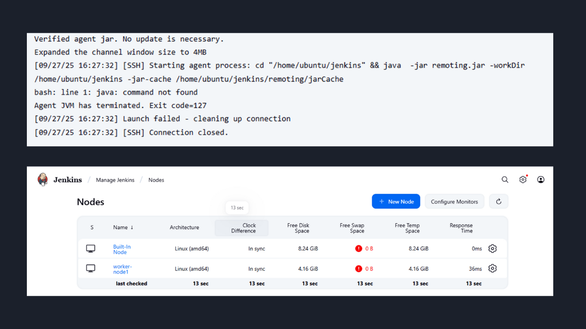
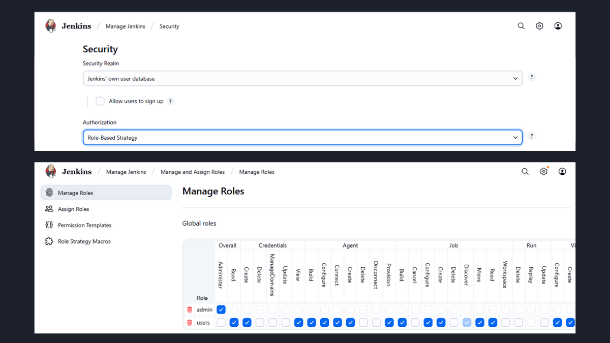
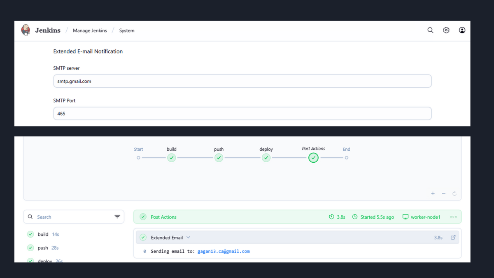

# Week 6: Building a Professional CI/CD Pipeline with Jenkins

This directory contains my project report for Week 6 of the #90DaysOfDevOps challenge. This week was a deep dive into Jenkins, where I built a complete, end-to-end CI/CD pipeline for the multi-container ChatApp project from Week 5.

The goal was to move beyond a simple build and implement the features of a real-world, production-grade automation system, including distributed builds, security, and maintainability.

**➡️ You can view my final Jenkinsfile here:**
[**Gagandeepsingh9/ChatApp/Jenkinsfile (branch: week6-CICD)**](https://github.com/Gagandeepsingh9/ChatApp/blob/week6-CICD/Jenkinsfile)

**➡️ And my custom Jenkins Shared Library is here:**
[**Gagandeepsingh9/Chatapp-jenkins-shared-library**](https://github.com/Gagandeepsingh9/Chatapp-jenkins-shared-library)

---

### Key Features of My CI/CD Pipeline

#### 1. End-to-End Automation
I created a multi-stage declarative pipeline that automates the entire process of delivering the ChatApp. As shown in my `Jenkinsfile`, the pipeline consists of five distinct stages:
*   **Clone:** Checks out the source code from the `week6-CICD` Git branch.
*   **Build:** Builds the Java application and creates a new Docker image.
*   **Test:** Runs a Trivy scan on the newly built image to check for vulnerabilities.
*   **Push:** Pushes the validated Docker image to my Docker Hub repository.
*   **Deploy:** Uses `docker compose up -d` to deploy the full application stack on the agent.

#### 2. Scalable, Distributed Builds with Jenkins Agents
To follow best practices and prepare for a larger workload, I did not run the builds on the Jenkins master node. Instead, I configured a dedicated **worker node** (agent). My pipeline is configured with `agent {label "dev-node1"}` to ensure all jobs run on this separate agent, keeping the master node free for orchestration.

*   **Real-World Troubleshooting:** As part of this process, I encountered and solved a common issue where the agent was missing a required dependency (Java). My screenshots document this error and the successful connection after I installed it.

#### 3. Secure Access with Role-Based Authorization Control (RBAC)
Security is critical in a CI/CD environment. I installed the Role Strategy Plugin and configured RBAC to control who can do what within Jenkins. My screenshots show the full process of creating separate roles for "admins" and "users" with different levels of permissions, ensuring that access to the system is properly managed.

#### 4. Clean, Maintainable Pipelines with Shared Libraries
This was the most advanced and rewarding part of the challenge. To avoid having a long, complicated `Jenkinsfile` and to promote code reuse, I created a **Jenkins Shared Library** in its own separate Git repository.

I broke down each major pipeline action into its own Groovy script (`cloning.groovy`, `building.groovy`, `testing.groovy`, `docker_push.groovy`). Each script contains a single, reusable function that accepts parameters.

My screenshots of the Jenkins configuration show how this library was integrated. The most important details are in the code itself:
*   The `docker_push.groovy` script correctly uses the Jenkins **Credentials Binding plugin** to securely inject the Docker Hub credentials, which is a major security best practice.
*   The `testing.groovy` script runs the `trivy` scan and saves the output, integrating security directly into the pipeline.

As a result, my final `Jenkinsfile` is incredibly clean and readable. It describes *what* the pipeline does at a high level, while the Shared Library handles the complex details of *how* each step is executed.

#### 5. Automated Feedback Loops (Webhooks & Notifications)
To create a true Continuous Integration system, I configured two key feedback mechanisms:
*   **GitHub Webhook:** My screenshots show the setup of a webhook in my `ChatApp` GitHub repository, which automatically triggers the Jenkins pipeline every time I push a new code change.
*   **Email Notifications:** I used the `emailext` plugin within a `post` block in my `Jenkinsfile`. As my screenshots of a successful build show, this automatically sends an email notification with the build status after every pipeline run.

---
### My Key Takeaway
This week was an incredible experience that connected all the previous topics. I learned that a professional CI/CD pipeline is so much more than just a build script. It's a scalable, secure, and maintainable system that provides the backbone for modern software delivery. 