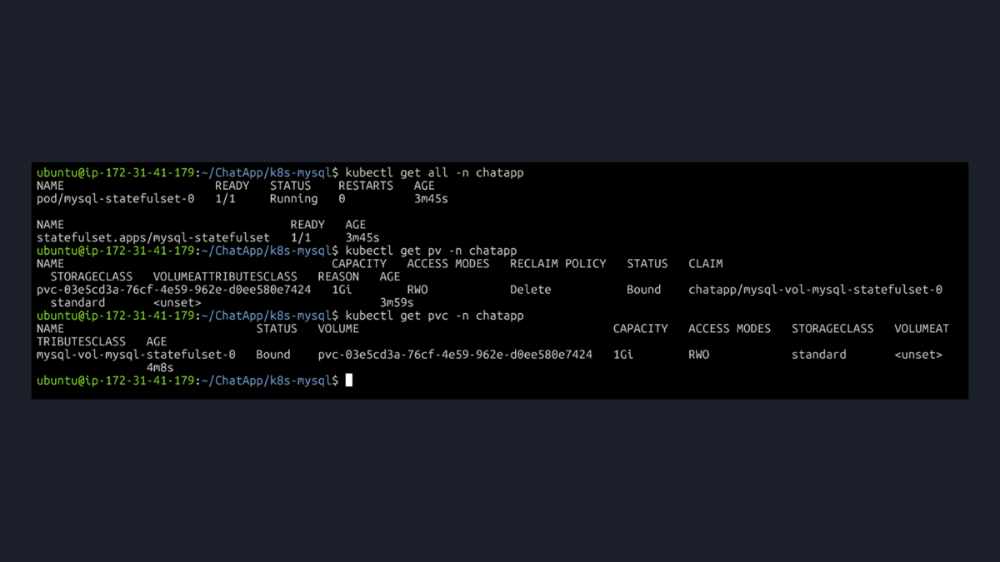
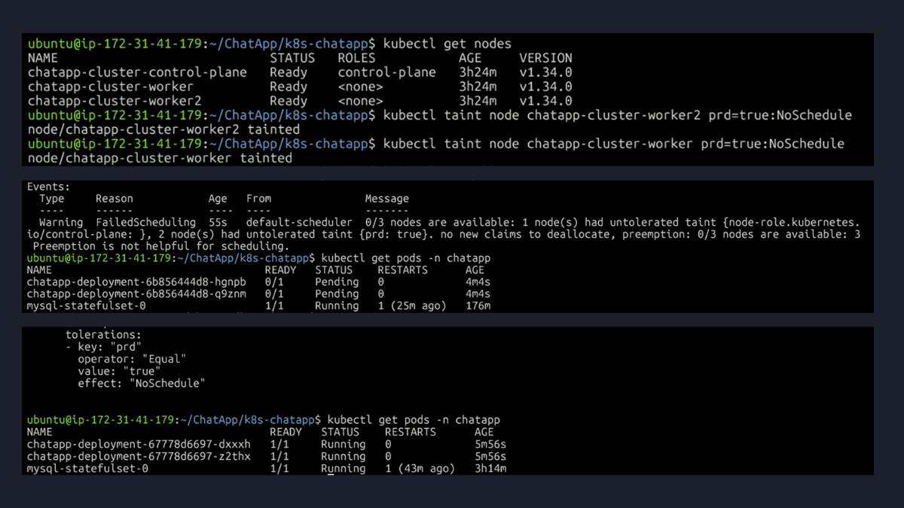
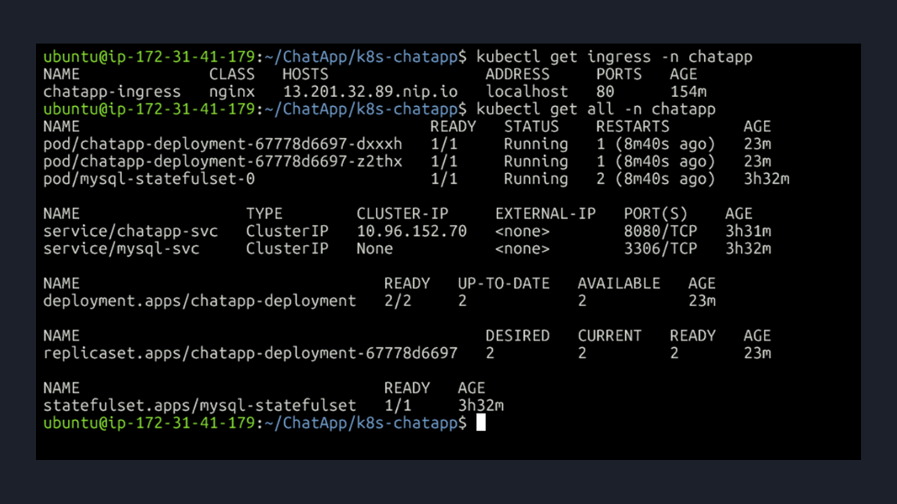
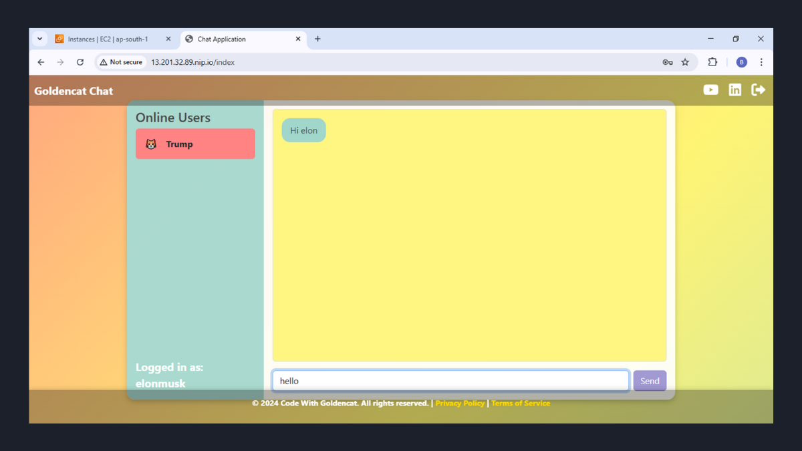

# Week 7: Orchestrating a Production-Style Application with Kubernetes

This directory contains my project report for Week 7 of the #90DaysOfDevOps challenge. This week was a deep dive into kubernetes, where I deployed my containerized ChatApp onto a custom, multi-node Kubernetes cluster. The goal was to build and troubleshoot a full, production-style environment from the ground up.

This `README.md` serves as a detailed report of the architecture I built, the problems I solved, and the advanced concepts I implemented, with direct links to the manifest files.

**➡️ You can see all my Kubernetes manifest files on GitHub here:**
[**Gagandeepsingh9/ChatApp (branch: week7-k8s)**](https://github.com/Gagandeepsingh9/ChatApp/tree/week7-k8s)

---

### Key Kubernetes Concepts I Implemented

#### 1. The Foundation: A Custom Multi-Node Cluster
I started by building my own local, multi-node Kubernetes cluster using **Kind**. My configuration file defined a cluster with one control-plane and multiple worker nodes.

Crucially, I made two key architectural decisions in this file to prepare for a production-style deployment:
1.  **`disableDefaultCNI: true`**: This was done so I could install Calico later, a CNI that supports `NetworkPolicy`.
2.  **`extraPortMappings`**: I opened ports 80 and 443 on the control-plane node to allow traffic to reach the NGINX Ingress Controller.
*   **View my Kind cluster configuration:** [**kind-cluster-config.yml**](https://github.com/Gagandeepsingh9/ChatApp/blob/week7-k8s/kind-cluster-config.yml)

#### 2. Separating Configuration from Code: `ConfigMap` & `Secret`
To follow best practices, I externalized all application configuration.
*   **`ConfigMap`**: I created a `ConfigMap` to store non-sensitive data, such as the `mysql_user` and `mysql_database` names.
*   **`Secret`**: I used a `Secret` to store sensitive data, like the `root_pass` and `password` for the database, which are base64 encoded for security.
These were then securely injected into the application and database pods as environment variables using `valueFrom`.
*   **View manifests:** [**ConfigMap**](https://github.com/Gagandeepsingh9/ChatApp/blob/week7-k8s/k8s-mysql/configmap_mysql.yaml) | [**Secret**](https://github.com/Gagandeepsingh9/ChatApp/blob/week7-k8s/k8s-mysql/secret_mysql.yaml)

#### 3. Deploying the Stateful App (The Database)
To properly manage the database, I used a **`StatefulSet`**, which is the professional standard for stateful applications on Kubernetes. This provides stable pod identity and, most importantly, stable storage.

I used `volumeClaimTemplates` to ensure that each database pod automatically gets its own `PersistentVolumeClaim`, which then binds to a `PersistentVolume` I defined. This guarantees that the database always reconnects to its own specific data, preventing data loss. I also created a **Headless Service** (`clusterIP: None`) to give the pods a stable network identity to enable direct, one-to-one communication with individual pods.
*   **View manifests:** [**StatefulSet**](https://github.com/Gagandeepsingh9/ChatApp/blob/week7-k8s/k8s-mysql/statefulsets.yaml) | [**Headless Service**](https://github.com/Gagandeepsingh9/ChatApp/blob/week7-k8s/k8s-mysql/service_mysql.yaml) | [**PV & PVC**](https://github.com/Gagandeepsingh9/ChatApp/blob/week7-k8s/k8s-mysql/persistent_Volume.yaml)

#### 4. Deploying the Stateless App (The ChatApp)
I used a `Deployment` to manage the stateless frontend application, ensuring high availability with `replicas: 2`. I also implemented several production-ready features:
*   **Health Checks (Probes):** I added `startupProbe`, `livenessProbe`, and `readinessProbe`. These are critical for building a self-healing system. For example, the `readinessProbe` checks the `/login` path to ensure the pod only receives traffic when it's truly ready to serve users.
*   **Resource Management:** I set `requests` and `limits` for CPU and memory to ensure predictable performance and stability.
*   **Autoscaling:** I implemented a **HorizontalPodAutoscaler (HPA)** to automatically scale the app from 1 to 4 pods based on CPU usage.
*   **View manifests:** [**Deployment**](https://github.com/Gagandeepsingh9/ChatApp/blob/week7-k8s/k8s-chatapp/deployment_chatapp.yaml) | [**HPA**](https://github.com/Gagandeepsingh9/ChatApp/blob/week7-k8s/k8s-chatapp/hpa.yaml)

#### 5. Advanced Scheduling & Troubleshooting: Taints & Tolerations
I simulated a real-world scenario where certain nodes are reserved for specific workloads.
*   **The Problem:** I applied a **`taint`** to my worker nodes. As a result, my application pods got stuck in a `Pending` state.
*   **The Diagnosis:** By inspecting the events with `kubectl describe`, I saw the "FailedScheduling" error, which clearly stated that the pods had an "untolerated taint."
*   **The Solution:** I fixed this by adding a corresponding **`toleration`** block to my `Deployment` manifest. This allowed the Kubernetes scheduler to place the pods on the tainted nodes successfully.

#### 6. Exposing the App & Ingress Troubleshooting
This was the most complex and rewarding part of the project. I set up a full Ingress workflow to expose my application, which involved deploying an NGINX Ingress Controller.
*   **Troubleshooting Session Stickiness:**
    *   **The Problem:** I discovered a major bug: when I logged in, the Ingress load balancer would sometimes send my next request to the *other* pod, which wasn't aware of my login session, breaking the user experience.
    *   **The Diagnosis:** I identified this as a "session affinity" problem.
    *   **The Solution:** I fixed it by adding the `nginx.ingress.kubernetes.io/affinity: "cookie"` annotation to my `Ingress` manifest. This clever fix ensures that a user is always "stuck" to the same pod for their entire session, providing a smooth experience. 
*   **View my Ingress manifest:** [**ingress.yaml**](https://github.com/Gagandeepsingh9/ChatApp/blob/week7-k8s/k8s-chatapp/ingress.yaml)

#### 7. Security: RBAC & Network Policies
I implemented security at multiple layers.
*   **Network Policy (Internal Firewall):** I created a Kubernetes `NetworkPolicy` that acts as a firewall. It ensures that **only** the ChatApp pods are allowed to connect to the MySQL database pods on port 3306.
*   **RBAC:** I configured a `ServiceAccount`, `Role`, and `RoleBinding` to give my application specific, limited permissions within the cluster, following the principle of least privilege.
*   **View manifests:** [**Network Policy**](https://github.com/Gagandeepsingh9/ChatApp/blob/week7-k8s/k8s-mysql/network_policies.yaml) | [**RBAC**](https://github.com/Gagandeepsingh9/ChatApp/blob/week7-k8s/k8s-chatapp/role.yaml)

---
### My Key Takeaway
This week was an incredible, deep dive into what it truly means to orchestrate an application. The real learning wasn't just in writing the YAML files, but in troubleshooting real-world problems. 